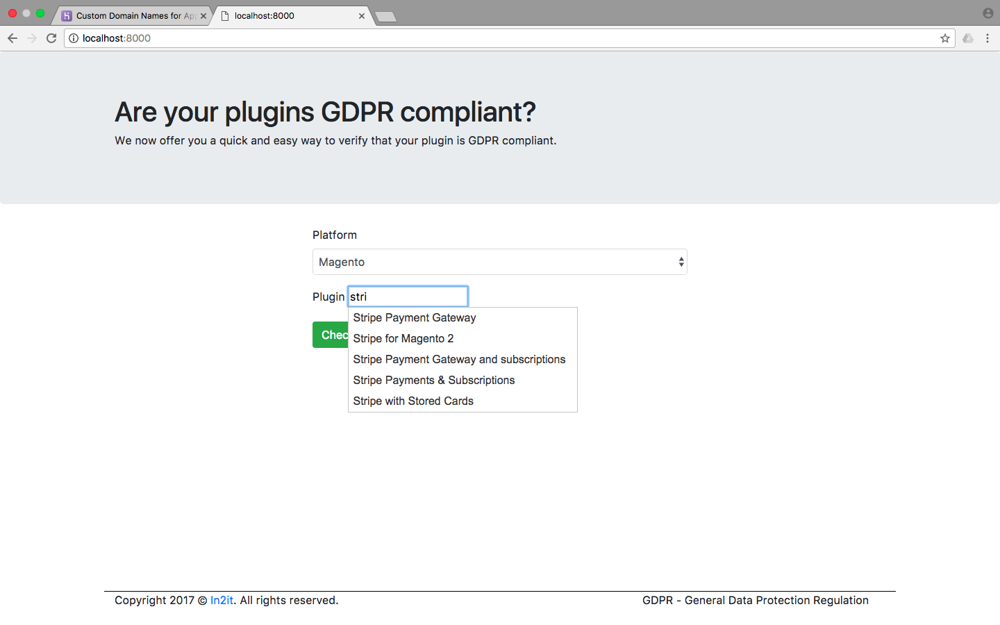
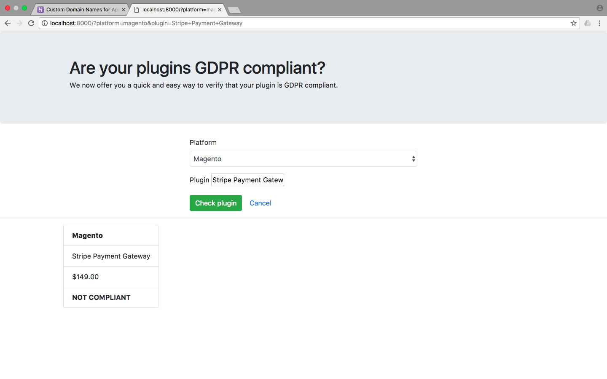

# E-commerce plugin checker for GDPR compliance

This tool allows you to check your e-commerce platform plugins to verify if they are GDPR compliant.

## Concept

We have looked at three e-commerce platforms and their plugin eco system and found out that at the point
of writing, none of their plugins are GDPR compliant.

## Requirements

- PHP 7.1+
- ext/pdo
- ext/pdo_sqlite

## Installation and running

Best would be that you fork this project to your own repostiory before you're checking it out.

```
git clone git@github.com:<username>/gdpr-plugin-check
```

To get it up-and-running locally, all you have to do is run the build-in PHP web server.

```
php -S 127.0.0.1:9999 check-plugin.php
```

You should see the following screen where auto-complete offers suggestions for the plugins we have collected.

[](docs/01_autocomplete.png)]

Once a platform and plugin are selected, you can check the compliance of the plugin.

[](docs/02_check_result.png)

## Roadmap

- provide RSS/Atom feed for updates of plugin database
- provide links to plugin maintainer and service it provides
